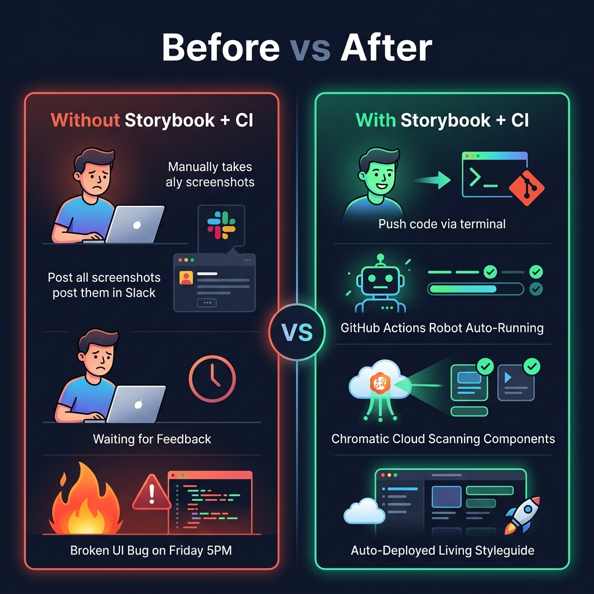
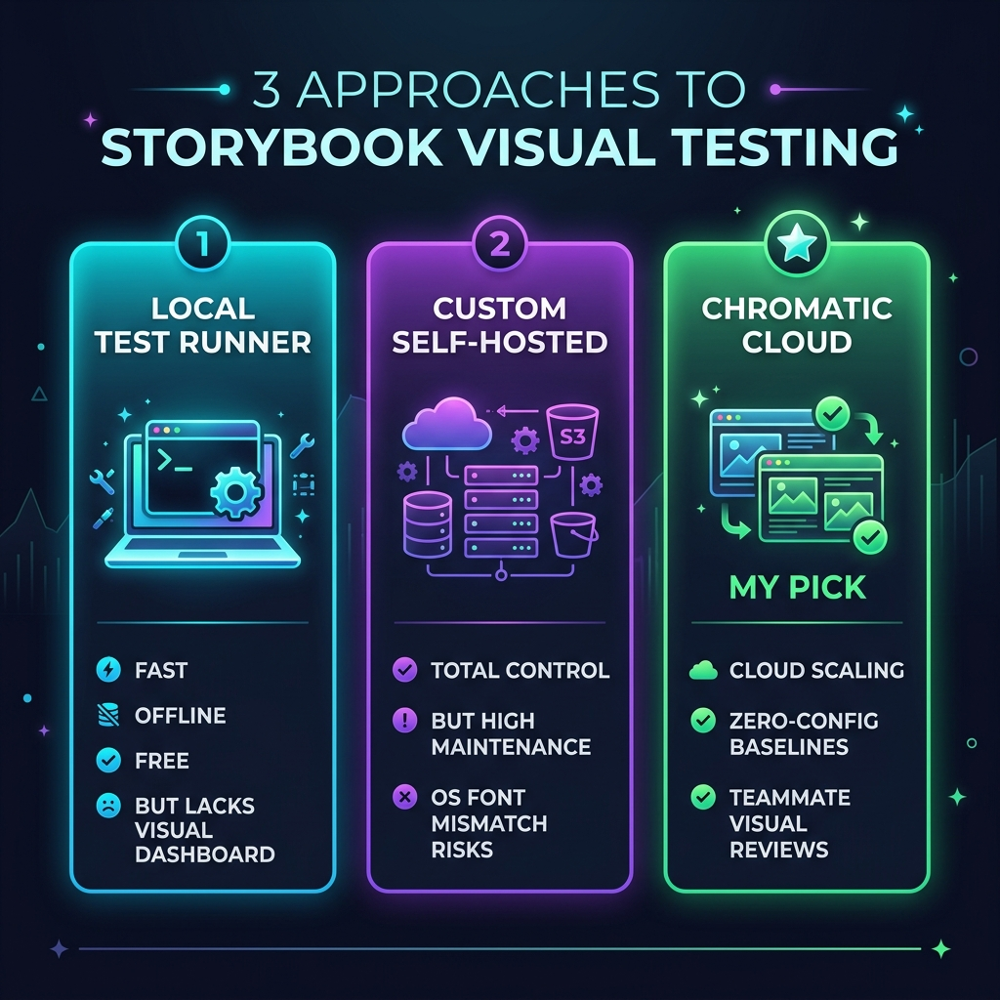

# Storybook + CI: My Favorite Frontend Feedback Loop

> Proof-of-concept repo for the blog post:
> 📖 **[Read the full article on Medium →](https://medium.com/@ahmedrebai/storybook-ci-my-favorite-frontend-feedback-loop-visual-testing-pipeline-tips-eac0019c757e)**

---

## What's Inside

A React + TypeScript + Vite project with Storybook and a full visual regression CI pipeline using Chromatic and GitHub Actions.

---

## Blog Sections → Code Map

### 1. What is Storybook?
Three components, each with all their states as stories:

| Component | Stories |
|---|---|
| `Button` | Primary, Danger, Disabled, Loading |
| `Modal` | Default, With Footer, Without Footer |
| `Card` | Default, Loading Skeleton, Error State |

```bash
npm run storybook
# Opens at http://localhost:6006
```

---

### 2. Before vs After


---

### 3. Adding CI to the Mix
Three approaches compared — we use **Chromatic** (cloud).



---

### 4. Setting Up Chromatic
1. Create account at [chromatic.com](https://www.chromatic.com)
2. Get your project token
3. Add it to GitHub → Settings → Secrets → `CHROMATIC_PROJECT_TOKEN`
4. Push — the pipeline runs automatically

---

### 5. GitHub Actions Workflow
`.github/workflows/visual-test.yml` — triggers on every push and PR.

---

### 6. Catching a Real Visual Bug
The `Button` Danger state is intentionally styled **green instead of red**.
Chromatic catches it. Unit tests don't. See [`BUG_REPORT.md`](./BUG_REPORT.md).

---

### 7. Bonus: Auto-Deploy Storybook
`.github/workflows/storybook-deploy.yml` — deploys your living component library to GitHub Pages on every merge to `main`.

---

## Run Locally

```bash
npm install --legacy-peer-deps
npm run storybook
```
